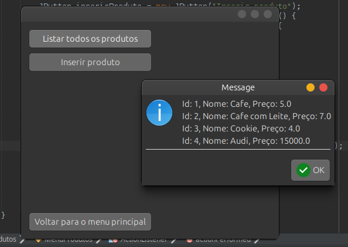
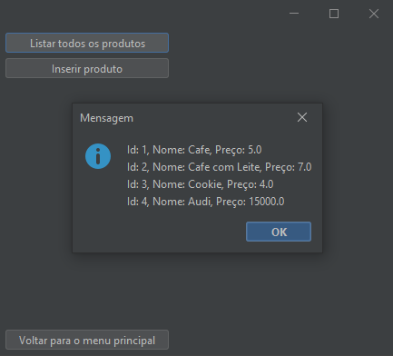

# Sistema de Gestão de Cafeteria - Interface Gráfica com JOptionPane

Este projeto é um sistema de **gestão de cafeteria** desenvolvido em **Java** usando **Swing** com **JOptionPane** para a interface gráfica. A aplicação permite o gerenciamento de produtos (cafés, lanches, etc.), funcionários e pedidos de clientes, utilizando caixas de diálogo para interação com o usuário.

O objetivo do sistema é fornecer uma maneira fácil e eficiente para gerenciar os produtos da cafeteria, funcionários e pedidos, tudo de forma intuitiva por meio de caixas de diálogo.

## Funcionalidades

- **Gestão de Produtos**:
  - Cadastro de novos produtos (nome, preço, categoria, etc.).
  - Listagem de produtos cadastrados.
  - Edição e remoção de produtos existentes.

- **Gestão de Funcionários**:
  - Cadastro de funcionários (nome, cargo, salário, etc.).
  - Listagem, edição e remoção de funcionários.
  
- **Gestão de Pedidos**:
  - Criação de pedidos com produtos e quantidades.
  - Exibição do status do pedido (pendente, finalizado).
  - Relacionamento entre pedidos e clientes.
  
- **Interface Gráfica com JOptionPane**:
  - A interação com o sistema é feita através de caixas de diálogo do **JOptionPane**, fornecendo uma interface simples e prática para o usuário.
  - **JOptionPane** é utilizado para exibir mensagens, solicitar entradas do usuário, e confirmar ações como adição ou exclusão de dados.

## Tecnologias Utilizadas

- **Java**: Linguagem de programação principal.

## Funcionalidades Principais

### Gestão de Produtos

- **Adicionar Produto**: Ao ser solicitado, o sistema abre um campo de texto onde o usuário pode informar o nome, preço e categoria de um novo produto.
- **Listar Produtos**: O sistema exibe uma lista com todos os produtos cadastrados usando uma caixa de diálogo com as informações.
- **Editar Produto**: Permite alterar o nome ou preço de um produto selecionado.
- **Excluir Produto**: Solicita confirmação do usuário para excluir um produto.

### Gestão de Funcionários

- **Adicionar Funcionário**: Permite adicionar um novo funcionário, solicitando informações como nome, cargo e salário.
- **Listar Funcionários**: Exibe todos os funcionários cadastrados em uma lista de diálogo.
- **Editar Funcionário**: Permite editar dados de um funcionário.
- **Excluir Funcionário**: Solicita confirmação para excluir um funcionário.

### Gestão de Pedidos

- **Adicionar Pedido**: O usuário pode selecionar os produtos e suas quantidades, criando um novo pedido.
- **Listar Pedidos**: Exibe todos os pedidos realizados, com detalhes como produtos e status.
- **Alterar Status do Pedido**: O status de um pedido pode ser alterado, por exemplo, de "pendente" para "finalizado".

## Interface no Linux Ubuntu

## Interface no Windows

